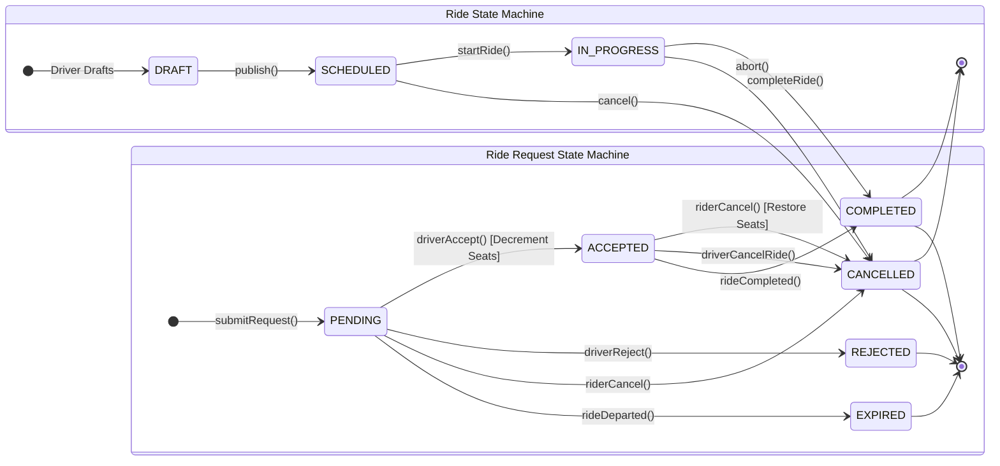
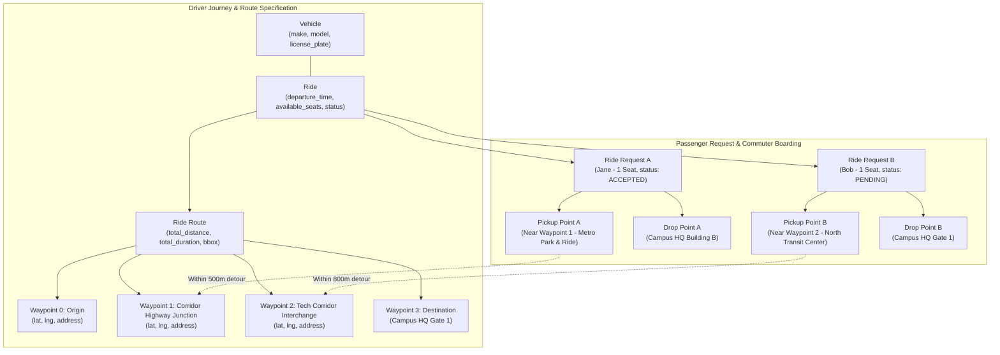

# Technical Architecture: Corporate Carpooling Platform

## 1. Architectural Style & Layering

The platform follows **Clean Architecture (Ports and Adapters)** principles to ensure strict separation between domain business rules, application orchestration, persistence, and delivery mechanisms.

```
+-----------------------------------------------------------------------------+
|                          INTERFACES / DELIVERY                              |
|   - HTTP REST Controllers / Next.js API Routes                              |
|   - Request DTO Validation (Zod schemas) & Response Serializers             |
+-----------------------------------------------------------------------------+
                                     |
                                     v
+-----------------------------------------------------------------------------+
|                          APPLICATION / USE CASES                            |
|   - CreateRideUseCase, RequestSeatUseCase, AcceptRequestUseCase             |
|   - Transaction boundaries (@Transactional)                                 |
|   - Domain Event Dispatching                                                |
+-----------------------------------------------------------------------------+
                                     |
                                     v
+-----------------------------------------------------------------------------+
|                           DOMAIN / CORE LOGIC                               |
|   - Entities: Ride, RideRequest, Vehicle, RouteWaypoint                     |
|   - Value Objects: GeoCoordinate, SeatCount, OrgDomain                      |
|   - Explicit State Machines: RideStateMachine, RideRequestStateMachine      |
|   - Domain Invariants: available_seats <= total_seats, no self-booking      |
+-----------------------------------------------------------------------------+
                                     ^
                                     |
+-----------------------------------------------------------------------------+
|                        INFRASTRUCTURE / ADAPTERS                            |
|   - Persistence: PostgreSQL Repositories (Prisma / Drizzle / Kysely)        |
|   - Geospatial: PostGIS / Spatial Bounding-Box Algorithms                   |
|   - Mail & Notifications: SMTP / Resend / Webhook Adapter                   |
|   - Clock & UUID Generators                                                 |
+-----------------------------------------------------------------------------+
```

---

## 2. Explicit State Machine Specifications

The system eliminates ambiguous lifecycle states by treating both `Ride` and `RideRequest` as rigorous Finite State Machines (FSM). State mutations outside these defined transitions are rejected with HTTP 409 Conflict.

### 2.1 Ride State Machine

| Current State | Transition Trigger / Action | Next State | Side Effects & Invariants |
| :--- | :--- | :--- | :--- |
| `DRAFT` | `publish()` | `SCHEDULED` | Departure time must be >= `now() + 30m`. Route must have at least 2 waypoints. |
| `SCHEDULED` | `startRide()` | `IN_PROGRESS` | Driver begins trip. Notifies all accepted passengers. |
| `SCHEDULED` | `cancel(reason)` | `CANCELLED` | Releases all accepted/pending requests. Emits urgent cancellation alerts. |
| `IN_PROGRESS`| `completeRide()` | `COMPLETED` | Driver reaches destination. Ride marked finalized. |
| `IN_PROGRESS`| `abort(reason)` | `CANCELLED` | Exceptional cancellation in transit. Triggers admin audit alert. |
| `COMPLETED` | *terminal* | - | No further transitions permitted. |
| `CANCELLED` | *terminal* | - | No further transitions permitted. |

### 2.2 Ride Request State Machine

| Current State | Transition Trigger / Action | Next State | Side Effects & Invariants |
| :--- | :--- | :--- | :--- |
| *initial* | `submitRequest()` | `PENDING` | Validates `available_seats >= requested_seats`. Ride must be `SCHEDULED`. |
| `PENDING` | `driverAccept()` | `ACCEPTED` | **Atomic**: Decrements `ride.available_seats` by `requested_seats`. |
| `PENDING` | `driverReject(reason)`| `REJECTED` | No seat changes. Dispatches rejection notification to rider. |
| `PENDING` | `riderCancel()` | `CANCELLED` | Request withdrawn by passenger before driver review. |
| `PENDING` | `rideDeparted()` | `EXPIRED` | Automatically expired when ride departs or is cancelled. |
| `ACCEPTED` | `riderCancel()` | `CANCELLED` | **Atomic**: Restores `requested_seats` back to `ride.available_seats`. |
| `ACCEPTED` | `driverCancelRide()` | `CANCELLED` | Ride cancellation cascades cancellation to all accepted requests. |
| `ACCEPTED` | `rideCompleted()` | `COMPLETED` | Passenger successfully commuted. |
| `REJECTED` | *terminal* | - | No further transitions permitted. |
| `EXPIRED` | *terminal* | - | No further transitions permitted. |
| `COMPLETED` | *terminal* | - | No further transitions permitted. |

---

## 3. Concurrency Control & Race Condition Prevention

### The Race Condition
Two passengers (Rider A and Rider B) concurrently request the last available seat on a ride (`available_seats = 1`). If the driver approves both requests simultaneously, or if automatic seat reservation occurs, a naive application would overbook the vehicle (`available_seats = -1`).

### Architectural Solution
We use a two-tiered concurrency defense:

1. **Pessimistic Row-Level Lock on Approval**:
   ```sql
   -- Executed inside a single SERIALIZABLE or READ COMMITTED transaction:
   BEGIN;
   
   -- 1. Lock the ride row exclusively:
   SELECT id, available_seats, status, version 
   FROM rides 
   WHERE id = :ride_id AND organization_id = :org_id 
   FOR UPDATE;

   -- 2. Verify state and capacity:
   -- IF status != 'SCHEDULED' THEN ROLLBACK; RAISE EXCEPTION;
   -- IF available_seats < :requested_seats THEN ROLLBACK; RAISE EXCEPTION;

   -- 3. Decrement seats atomically:
   UPDATE rides 
   SET available_seats = available_seats - :requested_seats,
       version = version + 1,
       updated_at = NOW()
   WHERE id = :ride_id;

   -- 4. Update request status:
   UPDATE ride_requests 
   SET status = 'ACCEPTED',
       responded_at = NOW(),
       version = version + 1,
       updated_at = NOW()
   WHERE id = :request_id;

   -- 5. Insert manifest record and audit log:
   INSERT INTO audit_logs (...);

   COMMIT;
   ```

2. **Database Check Constraint (Last Line of Defense)**:
   ```sql
   ALTER TABLE rides ADD CONSTRAINT chk_rides_available_seats_non_negative 
   CHECK (available_seats >= 0);
   ```
   Even if application logic fails, PostgreSQL will abort any transaction attempting to reduce `available_seats` below 0.

---

## 4. Route Modeling & Corridor Geolocation Strategy

### Anti-Pattern Avoidance
- **Anti-Pattern 1**: Storing commuter pickup/drop directly on the `rides` table.
  - *Correction*: Commuters have their own explicit `pickup_points` and `drop_points` associated with `ride_requests`.
- **Anti-Pattern 2**: Storing the route as an opaque polyline string without structured metadata.
  - *Correction*: The route is modeled as a parent `ride_routes` entity with an ordered child table `route_waypoints`.

### Structured Geographic Model
```
[ride_routes]
  ├── origin_lat / origin_lng / origin_address
  ├── destination_lat / destination_lng / destination_address
  ├── total_distance_meters / total_duration_seconds
  ├── bounding_box (min_lat, min_lng, max_lat, max_lng)
  │
  └── [route_waypoints] (1-to-Many, Ordered by stop_order ASC)
        ├── stop_order (0 = Origin, 1 = Waypoint 1, 2 = Waypoint 2, N = Destination)
        ├── point_type (ORIGIN, CORRIDOR, DESTINATION)
        ├── latitude / longitude (DECIMAL(10, 7))
        ├── geog (geography(Point, 4326))
        └── estimated_arrival_time
```

### Corridor Search Query
To find rides matching a commuter's trip from `P_pickup` to `P_drop`:
1. **Bounding Box Filter**: Identify routes whose bounding box encompasses both points (indexed with B-tree on lat/lng or PostGIS spatial index).
2. **Proximity Check**:
   ```sql
   -- Find rides passing within 2000m of Rider's pickup AND within 1000m of Rider's drop:
   SELECT r.id, r.driver_id, r.departure_time, r.available_seats
   FROM rides r
   JOIN ride_routes rr ON rr.ride_id = r.id
   WHERE r.organization_id = :org_id
     AND r.status = 'SCHEDULED'
     AND r.available_seats >= :requested_seats
     AND r.departure_time BETWEEN :window_start AND :window_end
     AND EXISTS (
         SELECT 1 FROM route_waypoints w1
         WHERE w1.route_id = rr.id
           AND ST_DWithin(w1.geog, ST_MakePoint(:pickup_lng, :pickup_lat)::geography, 2000)
     )
     AND EXISTS (
         SELECT 1 FROM route_waypoints w2
         WHERE w2.route_id = rr.id
           AND ST_DWithin(w2.geog, ST_MakePoint(:drop_lng, :drop_lat)::geography, 1000)
     );
   ```

---

## 5. Canonical Diagram: Ride & Request State Machines



---

## 6. Canonical Diagram: Route, Waypoint & Pickup/Drop Relationship


