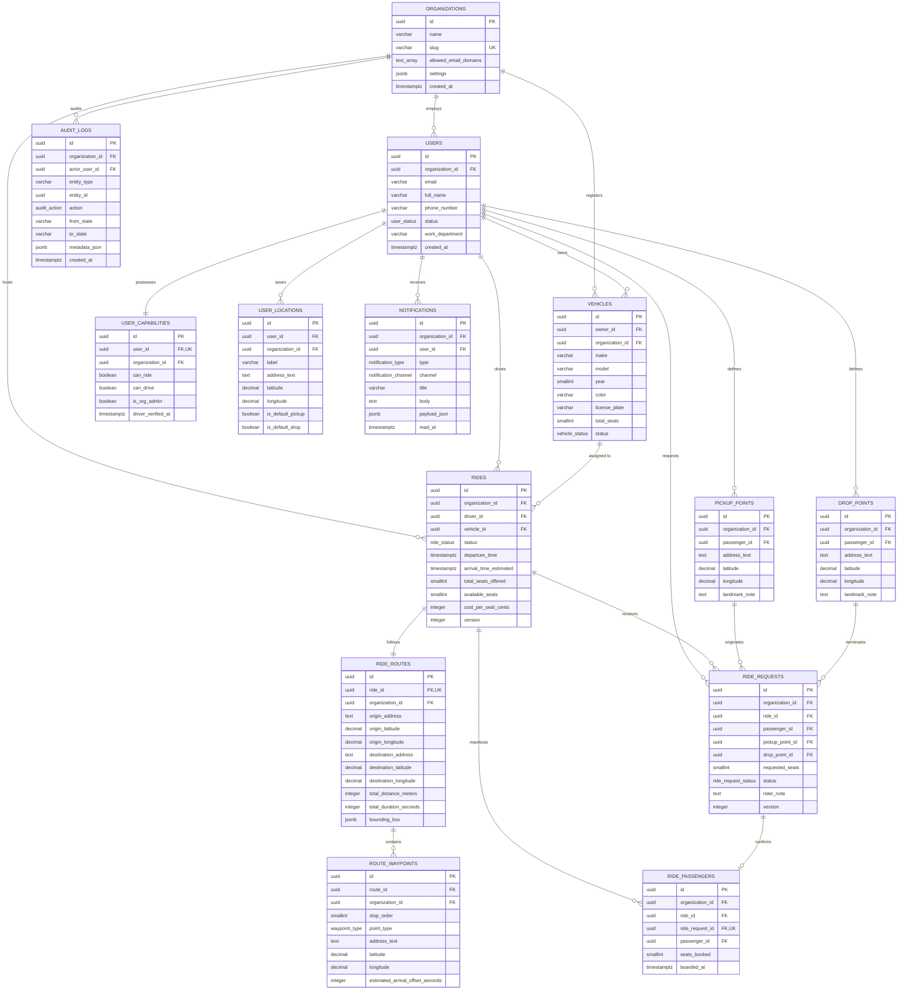

# Database Schema Specification: Corporate Carpooling Platform

## 1. Design Philosophy & Architectural Guarantees

This database schema is designed by first principles to serve as the unshakeable foundation for the corporate carpooling platform. It models true domain entities and relationships, adhering to the following strict architectural invariants:

1. **Clean Separation of Concerns**:
   - `users` (Identity) $\ne$ `vehicles` (Assets) $\ne$ `rides` (Scheduled journeys) $\ne$ `ride_routes` (Geographic corridors) $\ne$ `ride_requests` (Booking bids) $\ne$ `pickup_points` / `drop_points` (Commuter boardings).
   - Commuter pickup/drop data is **never** stored directly on the `rides` table.
   - Routes are **never** stored as opaque blackbox strings; they are decomposed into structured geographic entities and ordered waypoints.
2. **Strict Multi-Tenant Isolation**:
   - `organization_id` is an explicit, non-nullable foreign key on every operational entity.
   - All unique indexes and compound query indexes are prefixed or scoped with `organization_id`.
3. **Finite State Machines & Atomic Invariants**:
   - `rides.status` and `ride_requests.status` are backed by explicit PostgreSQL enums.
   - Invariant `available_seats >= 0` and `available_seats <= total_seats_offered` enforced via database check constraints.
   - Atomic reservation with version-based Optimistic Concurrency Control (OCC) and pessimistic lock support.
4. **Migration Safety**:
   - UUIDv4 primary keys via `gen_random_uuid()` (avoids sequential ID scraping and enables distributed generation).
   - Additive-only schema expansion patterns.
   - Explicit foreign key delete policies (`ON DELETE RESTRICT` for financial/operational ledgers; `CASCADE` only for owned child sub-entities like waypoints).
   - Indexed foreign keys to avoid full table locks during cascading operations.

---

## 2. Canonical Diagram: Entity-Relationship Diagram (ERD)



---

## 3. Complete PostgreSQL DDL Specification

```sql
-- ============================================================================
-- CORPORATE CARPOOLING PLATFORM: CANONICAL DDL SPECIFICATION
-- Target: PostgreSQL 15+ (Compatible with PostGIS)
-- ============================================================================

-- Enable required extensions
CREATE EXTENSION IF NOT EXISTS "pgcrypto";

-- ----------------------------------------------------------------------------
-- 1. ENUMS
-- ----------------------------------------------------------------------------
CREATE TYPE user_status AS ENUM (
    'ACTIVE',
    'INACTIVE',
    'SUSPENDED',
    'PENDING_VERIFICATION'
);

CREATE TYPE vehicle_status AS ENUM (
    'ACTIVE',
    'INACTIVE',
    'PENDING_INSPECTION'
);

CREATE TYPE ride_status AS ENUM (
    'DRAFT',
    'SCHEDULED',
    'IN_PROGRESS',
    'COMPLETED',
    'CANCELLED'
);

CREATE TYPE ride_request_status AS ENUM (
    'PENDING',
    'ACCEPTED',
    'REJECTED',
    'CANCELLED',
    'EXPIRED',
    'COMPLETED'
);

CREATE TYPE waypoint_type AS ENUM (
    'ORIGIN',
    'CORRIDOR',
    'DESTINATION',
    'PASSENGER_STOP'
);

CREATE TYPE notification_type AS ENUM (
    'RIDE_REQUESTED',
    'REQUEST_ACCEPTED',
    'REQUEST_REJECTED',
    'REQUEST_CANCELLED',
    'RIDE_CANCELLED',
    'RIDE_STARTED',
    'RIDE_COMPLETED',
    'SYSTEM_ANNOUNCEMENT'
);

CREATE TYPE notification_channel AS ENUM (
    'IN_APP',
    'EMAIL',
    'SMS',
    'PUSH'
);

CREATE TYPE audit_action AS ENUM (
    'CREATE',
    'UPDATE',
    'STATE_TRANSITION',
    'DELETE',
    'CANCEL'
);

-- ----------------------------------------------------------------------------
-- 2. ORGANIZATIONS (Tenant Root)
-- ----------------------------------------------------------------------------
CREATE TABLE organizations (
    id UUID PRIMARY KEY DEFAULT gen_random_uuid(),
    name VARCHAR(255) NOT NULL,
    slug VARCHAR(100) NOT NULL,
    allowed_email_domains TEXT[] NOT NULL,
    settings JSONB NOT NULL DEFAULT '{}'::jsonb,
    is_active BOOLEAN NOT NULL DEFAULT true,
    created_at TIMESTAMPTZ NOT NULL DEFAULT NOW(),
    updated_at TIMESTAMPTZ NOT NULL DEFAULT NOW(),
    CONSTRAINT uq_organizations_slug UNIQUE (slug)
);

CREATE INDEX idx_organizations_slug ON organizations (slug);

-- ----------------------------------------------------------------------------
-- 3. USERS (Identity & Tenant Members)
-- ----------------------------------------------------------------------------
CREATE TABLE users (
    id UUID PRIMARY KEY DEFAULT gen_random_uuid(),
    organization_id UUID NOT NULL REFERENCES organizations(id) ON DELETE RESTRICT,
    email VARCHAR(255) NOT NULL,
    full_name VARCHAR(255) NOT NULL,
    phone_number VARCHAR(50),
    avatar_url TEXT,
    status user_status NOT NULL DEFAULT 'ACTIVE',
    work_department VARCHAR(100),
    work_location VARCHAR(150),
    created_at TIMESTAMPTZ NOT NULL DEFAULT NOW(),
    updated_at TIMESTAMPTZ NOT NULL DEFAULT NOW(),
    CONSTRAINT uq_users_org_email UNIQUE (organization_id, email)
);

CREATE INDEX idx_users_org_status ON users (organization_id, status);
CREATE INDEX idx_users_email ON users (email);

-- ----------------------------------------------------------------------------
-- 4. USER CAPABILITIES (Role-Based Permissions & Driver Flags)
-- ----------------------------------------------------------------------------
CREATE TABLE user_capabilities (
    id UUID PRIMARY KEY DEFAULT gen_random_uuid(),
    user_id UUID NOT NULL REFERENCES users(id) ON DELETE CASCADE,
    organization_id UUID NOT NULL REFERENCES organizations(id) ON DELETE RESTRICT,
    can_ride BOOLEAN NOT NULL DEFAULT true,
    can_drive BOOLEAN NOT NULL DEFAULT false,
    is_org_admin BOOLEAN NOT NULL DEFAULT false,
    driver_verified_at TIMESTAMPTZ,
    created_at TIMESTAMPTZ NOT NULL DEFAULT NOW(),
    updated_at TIMESTAMPTZ NOT NULL DEFAULT NOW(),
    CONSTRAINT uq_user_capabilities_user UNIQUE (user_id)
);

CREATE INDEX idx_user_capabilities_org_driver ON user_capabilities (organization_id, can_drive);

-- ----------------------------------------------------------------------------
-- 5. USER LOCATIONS (Saved Commute Presets)
-- ----------------------------------------------------------------------------
CREATE TABLE user_locations (
    id UUID PRIMARY KEY DEFAULT gen_random_uuid(),
    user_id UUID NOT NULL REFERENCES users(id) ON DELETE CASCADE,
    organization_id UUID NOT NULL REFERENCES organizations(id) ON DELETE RESTRICT,
    label VARCHAR(100) NOT NULL, -- e.g. 'Home', 'Campus HQ', 'North Transit Center'
    address_text TEXT NOT NULL,
    latitude DECIMAL(10, 7) NOT NULL,
    longitude DECIMAL(10, 7) NOT NULL,
    place_id VARCHAR(255),
    is_default_pickup BOOLEAN NOT NULL DEFAULT false,
    is_default_drop BOOLEAN NOT NULL DEFAULT false,
    created_at TIMESTAMPTZ NOT NULL DEFAULT NOW(),
    updated_at TIMESTAMPTZ NOT NULL DEFAULT NOW(),
    CONSTRAINT chk_user_locations_coords CHECK (
        latitude BETWEEN -90.0 AND 90.0 AND longitude BETWEEN -180.0 AND 180.0
    )
);

CREATE INDEX idx_user_locations_user ON user_locations (user_id);
CREATE INDEX idx_user_locations_org ON user_locations (organization_id);

-- ----------------------------------------------------------------------------
-- 6. VEHICLES (Registered Driver Vehicles)
-- ----------------------------------------------------------------------------
CREATE TABLE vehicles (
    id UUID PRIMARY KEY DEFAULT gen_random_uuid(),
    owner_id UUID NOT NULL REFERENCES users(id) ON DELETE RESTRICT,
    organization_id UUID NOT NULL REFERENCES organizations(id) ON DELETE RESTRICT,
    make VARCHAR(100) NOT NULL,
    model VARCHAR(100) NOT NULL,
    year SMALLINT NOT NULL CHECK (year >= 1990 AND year <= 2100),
    color VARCHAR(50) NOT NULL,
    license_plate VARCHAR(50) NOT NULL,
    total_seats SMALLINT NOT NULL CHECK (total_seats >= 2 AND total_seats <= 15),
    status vehicle_status NOT NULL DEFAULT 'ACTIVE',
    verified_at TIMESTAMPTZ,
    created_at TIMESTAMPTZ NOT NULL DEFAULT NOW(),
    updated_at TIMESTAMPTZ NOT NULL DEFAULT NOW(),
    CONSTRAINT uq_vehicles_org_plate UNIQUE (organization_id, license_plate)
);

CREATE INDEX idx_vehicles_owner ON vehicles (owner_id);
CREATE INDEX idx_vehicles_org_status ON vehicles (organization_id, status);

-- ----------------------------------------------------------------------------
-- 7. RIDES (Scheduled Host Journeys)
-- ----------------------------------------------------------------------------
CREATE TABLE rides (
    id UUID PRIMARY KEY DEFAULT gen_random_uuid(),
    organization_id UUID NOT NULL REFERENCES organizations(id) ON DELETE RESTRICT,
    driver_id UUID NOT NULL REFERENCES users(id) ON DELETE RESTRICT,
    vehicle_id UUID NOT NULL REFERENCES vehicles(id) ON DELETE RESTRICT,
    status ride_status NOT NULL DEFAULT 'DRAFT',
    departure_time TIMESTAMPTZ NOT NULL,
    arrival_time_estimated TIMESTAMPTZ NOT NULL,
    total_seats_offered SMALLINT NOT NULL CHECK (total_seats_offered >= 1 AND total_seats_offered <= 14),
    available_seats SMALLINT NOT NULL CHECK (available_seats >= 0),
    cost_per_seat_cents INTEGER NOT NULL DEFAULT 0 CHECK (cost_per_seat_cents >= 0),
    currency VARCHAR(3) NOT NULL DEFAULT 'USD',
    notes TEXT,
    cancelled_reason TEXT,
    cancelled_at TIMESTAMPTZ,
    started_at TIMESTAMPTZ,
    completed_at TIMESTAMPTZ,
    version INTEGER NOT NULL DEFAULT 1,
    created_at TIMESTAMPTZ NOT NULL DEFAULT NOW(),
    updated_at TIMESTAMPTZ NOT NULL DEFAULT NOW(),
    CONSTRAINT chk_rides_seats_valid CHECK (available_seats <= total_seats_offered),
    CONSTRAINT chk_rides_time_valid CHECK (departure_time < arrival_time_estimated)
);

CREATE INDEX idx_rides_org_search ON rides (organization_id, status, departure_time) 
    WHERE status = 'SCHEDULED';
CREATE INDEX idx_rides_driver ON rides (driver_id, departure_time);
CREATE INDEX idx_rides_vehicle ON rides (vehicle_id);

-- ----------------------------------------------------------------------------
-- 8. RIDE ROUTES (Structured Geographic Route Metadata)
-- ----------------------------------------------------------------------------
CREATE TABLE ride_routes (
    id UUID PRIMARY KEY DEFAULT gen_random_uuid(),
    ride_id UUID NOT NULL REFERENCES rides(id) ON DELETE CASCADE,
    organization_id UUID NOT NULL REFERENCES organizations(id) ON DELETE RESTRICT,
    origin_address TEXT NOT NULL,
    origin_latitude DECIMAL(10, 7) NOT NULL,
    origin_longitude DECIMAL(10, 7) NOT NULL,
    destination_address TEXT NOT NULL,
    destination_latitude DECIMAL(10, 7) NOT NULL,
    destination_longitude DECIMAL(10, 7) NOT NULL,
    total_distance_meters INTEGER NOT NULL CHECK (total_distance_meters > 0),
    total_duration_seconds INTEGER NOT NULL CHECK (total_duration_seconds > 0),
    -- Discrete bounding box coordinates for fast B-Tree range queries:
    min_latitude DECIMAL(10, 7) NOT NULL,
    max_latitude DECIMAL(10, 7) NOT NULL,
    min_longitude DECIMAL(10, 7) NOT NULL,
    max_longitude DECIMAL(10, 7) NOT NULL,
    bounding_box JSONB NOT NULL, -- {"min_lat": X, "max_lat": Y, "min_lng": Z, "max_lng": W}
    encoded_polyline TEXT,
    created_at TIMESTAMPTZ NOT NULL DEFAULT NOW(),
    updated_at TIMESTAMPTZ NOT NULL DEFAULT NOW(),
    CONSTRAINT uq_ride_routes_ride UNIQUE (ride_id),
    CONSTRAINT chk_ride_routes_coords CHECK (
        origin_latitude BETWEEN -90.0 AND 90.0 AND origin_longitude BETWEEN -180.0 AND 180.0 AND
        destination_latitude BETWEEN -90.0 AND 90.0 AND destination_longitude BETWEEN -180.0 AND 180.0 AND
        min_latitude <= max_latitude AND min_longitude <= max_longitude
    )
);

CREATE INDEX idx_ride_routes_org ON ride_routes (organization_id);
CREATE INDEX idx_ride_routes_coords ON ride_routes (origin_latitude, origin_longitude, destination_latitude, destination_longitude);
CREATE INDEX idx_ride_routes_bbox ON ride_routes (min_latitude, max_latitude, min_longitude, max_longitude);

-- ----------------------------------------------------------------------------
-- 9. ROUTE WAYPOINTS (Structured Corridor Coordinates)
-- ----------------------------------------------------------------------------
CREATE TABLE route_waypoints (
    id UUID PRIMARY KEY DEFAULT gen_random_uuid(),
    route_id UUID NOT NULL REFERENCES ride_routes(id) ON DELETE CASCADE,
    organization_id UUID NOT NULL REFERENCES organizations(id) ON DELETE RESTRICT,
    stop_order SMALLINT NOT NULL CHECK (stop_order >= 0),
    point_type waypoint_type NOT NULL DEFAULT 'CORRIDOR',
    address_text TEXT,
    latitude DECIMAL(10, 7) NOT NULL,
    longitude DECIMAL(10, 7) NOT NULL,
    estimated_arrival_offset_seconds INTEGER DEFAULT 0 CHECK (estimated_arrival_offset_seconds >= 0),
    created_at TIMESTAMPTZ NOT NULL DEFAULT NOW(),
    CONSTRAINT uq_route_waypoints_order UNIQUE (route_id, stop_order),
    CONSTRAINT chk_route_waypoints_coords CHECK (
        latitude BETWEEN -90.0 AND 90.0 AND longitude BETWEEN -180.0 AND 180.0
    )
);

CREATE INDEX idx_route_waypoints_lookup ON route_waypoints (route_id, stop_order);
CREATE INDEX idx_route_waypoints_spatial ON route_waypoints (latitude, longitude);

-- Functional spatial index for PostGIS acceleration (when extension is active):
-- CREATE INDEX idx_route_waypoints_gist ON route_waypoints USING GIST (ST_SetSRID(ST_MakePoint(longitude, latitude), 4326)::geography);

-- ----------------------------------------------------------------------------
-- 10. PICKUP POINTS & DROP POINTS (Explicit Passenger Boarding Entities)
-- ----------------------------------------------------------------------------
CREATE TABLE pickup_points (
    id UUID PRIMARY KEY DEFAULT gen_random_uuid(),
    organization_id UUID NOT NULL REFERENCES organizations(id) ON DELETE RESTRICT,
    passenger_id UUID NOT NULL REFERENCES users(id) ON DELETE RESTRICT,
    address_text TEXT NOT NULL,
    latitude DECIMAL(10, 7) NOT NULL,
    longitude DECIMAL(10, 7) NOT NULL,
    landmark_note TEXT,
    created_at TIMESTAMPTZ NOT NULL DEFAULT NOW(),
    CONSTRAINT chk_pickup_coords CHECK (
        latitude BETWEEN -90.0 AND 90.0 AND longitude BETWEEN -180.0 AND 180.0
    )
);

CREATE INDEX idx_pickup_points_user ON pickup_points (passenger_id);
CREATE INDEX idx_pickup_points_org ON pickup_points (organization_id);

CREATE TABLE drop_points (
    id UUID PRIMARY KEY DEFAULT gen_random_uuid(),
    organization_id UUID NOT NULL REFERENCES organizations(id) ON DELETE RESTRICT,
    passenger_id UUID NOT NULL REFERENCES users(id) ON DELETE RESTRICT,
    address_text TEXT NOT NULL,
    latitude DECIMAL(10, 7) NOT NULL,
    longitude DECIMAL(10, 7) NOT NULL,
    landmark_note TEXT,
    created_at TIMESTAMPTZ NOT NULL DEFAULT NOW(),
    CONSTRAINT chk_drop_coords CHECK (
        latitude BETWEEN -90.0 AND 90.0 AND longitude BETWEEN -180.0 AND 180.0
    )
);

CREATE INDEX idx_drop_points_user ON drop_points (passenger_id);
CREATE INDEX idx_drop_points_org ON drop_points (organization_id);

-- ----------------------------------------------------------------------------
-- 11. RIDE REQUESTS (Passenger Booking Bids)
-- ----------------------------------------------------------------------------
CREATE TABLE ride_requests (
    id UUID PRIMARY KEY DEFAULT gen_random_uuid(),
    organization_id UUID NOT NULL REFERENCES organizations(id) ON DELETE RESTRICT,
    ride_id UUID NOT NULL REFERENCES rides(id) ON DELETE RESTRICT,
    passenger_id UUID NOT NULL REFERENCES users(id) ON DELETE RESTRICT,
    pickup_point_id UUID NOT NULL REFERENCES pickup_points(id) ON DELETE RESTRICT,
    drop_point_id UUID NOT NULL REFERENCES drop_points(id) ON DELETE RESTRICT,
    requested_seats SMALLINT NOT NULL DEFAULT 1 CHECK (requested_seats >= 1 AND requested_seats <= 4),
    status ride_request_status NOT NULL DEFAULT 'PENDING',
    rejection_reason TEXT,
    cancellation_reason TEXT,
    rider_note TEXT,
    responded_at TIMESTAMPTZ,
    cancelled_at TIMESTAMPTZ,
    version INTEGER NOT NULL DEFAULT 1,
    created_at TIMESTAMPTZ NOT NULL DEFAULT NOW(),
    updated_at TIMESTAMPTZ NOT NULL DEFAULT NOW()
);

-- Unique index ensuring a passenger cannot have multiple active/pending requests on the same ride:
CREATE UNIQUE INDEX uq_ride_requests_active_passenger 
    ON ride_requests (ride_id, passenger_id) 
    WHERE status IN ('PENDING', 'ACCEPTED');

CREATE INDEX idx_ride_requests_ride_status ON ride_requests (ride_id, status);
CREATE INDEX idx_ride_requests_passenger ON ride_requests (passenger_id, created_at DESC);
CREATE INDEX idx_ride_requests_org ON ride_requests (organization_id);

-- ----------------------------------------------------------------------------
-- 12. RIDE PASSENGERS (Confirmed Passenger Manifest)
-- ----------------------------------------------------------------------------
CREATE TABLE ride_passengers (
    id UUID PRIMARY KEY DEFAULT gen_random_uuid(),
    organization_id UUID NOT NULL REFERENCES organizations(id) ON DELETE RESTRICT,
    ride_id UUID NOT NULL REFERENCES rides(id) ON DELETE CASCADE,
    ride_request_id UUID NOT NULL REFERENCES ride_requests(id) ON DELETE RESTRICT,
    passenger_id UUID NOT NULL REFERENCES users(id) ON DELETE RESTRICT,
    seats_booked SMALLINT NOT NULL CHECK (seats_booked >= 1),
    boarded_at TIMESTAMPTZ,
    dropped_off_at TIMESTAMPTZ,
    created_at TIMESTAMPTZ NOT NULL DEFAULT NOW(),
    CONSTRAINT uq_ride_passengers_request UNIQUE (ride_request_id),
    CONSTRAINT uq_ride_passengers_seat UNIQUE (ride_id, passenger_id)
);

CREATE INDEX idx_ride_passengers_ride ON ride_passengers (ride_id);
CREATE INDEX idx_ride_passengers_passenger ON ride_passengers (passenger_id);

-- ----------------------------------------------------------------------------
-- 13. NOTIFICATIONS (Asynchronous User Alerts)
-- ----------------------------------------------------------------------------
CREATE TABLE notifications (
    id UUID PRIMARY KEY DEFAULT gen_random_uuid(),
    organization_id UUID NOT NULL REFERENCES organizations(id) ON DELETE RESTRICT,
    user_id UUID NOT NULL REFERENCES users(id) ON DELETE CASCADE,
    type notification_type NOT NULL,
    channel notification_channel NOT NULL DEFAULT 'IN_APP',
    title VARCHAR(255) NOT NULL,
    body TEXT NOT NULL,
    payload_json JSONB NOT NULL DEFAULT '{}'::jsonb,
    read_at TIMESTAMPTZ,
    sent_at TIMESTAMPTZ NOT NULL DEFAULT NOW(),
    created_at TIMESTAMPTZ NOT NULL DEFAULT NOW()
);

CREATE INDEX idx_notifications_user_unread ON notifications (user_id, read_at) 
    WHERE read_at IS NULL;
CREATE INDEX idx_notifications_org ON notifications (organization_id);

-- ----------------------------------------------------------------------------
-- 14. AUDIT LOGS (Immutable Compliance & Security Trail)
-- ----------------------------------------------------------------------------
CREATE TABLE audit_logs (
    id UUID PRIMARY KEY DEFAULT gen_random_uuid(),
    organization_id UUID NOT NULL REFERENCES organizations(id) ON DELETE RESTRICT,
    actor_user_id UUID REFERENCES users(id) ON DELETE SET NULL,
    entity_type VARCHAR(100) NOT NULL, -- e.g. 'RIDE', 'RIDE_REQUEST', 'VEHICLE'
    entity_id UUID NOT NULL,
    action audit_action NOT NULL,
    from_state VARCHAR(50),
    to_state VARCHAR(50),
    metadata_json JSONB NOT NULL DEFAULT '{}'::jsonb,
    ip_address VARCHAR(45),
    user_agent TEXT,
    created_at TIMESTAMPTZ NOT NULL DEFAULT NOW()
);

CREATE INDEX idx_audit_logs_entity ON audit_logs (entity_type, entity_id);
CREATE INDEX idx_audit_logs_actor ON audit_logs (actor_user_id, created_at DESC);
CREATE INDEX idx_audit_logs_org_created ON audit_logs (organization_id, created_at DESC);

-- ----------------------------------------------------------------------------
-- 15. USER PREFERENCES (Personalized Commuting Traits & AI Tags)
-- ----------------------------------------------------------------------------
CREATE TABLE user_preferences (
    id UUID PRIMARY KEY DEFAULT gen_random_uuid(),
    user_id UUID NOT NULL UNIQUE REFERENCES users(id) ON DELETE CASCADE,
    organization_id UUID NOT NULL REFERENCES organizations(id) ON DELETE RESTRICT,
    free_text_preferences TEXT,
    tags TEXT[] DEFAULT '{}',
    max_detour_minutes INTEGER DEFAULT 15,
    quiet_ride BOOLEAN DEFAULT FALSE,
    created_at TIMESTAMPTZ NOT NULL DEFAULT NOW(),
    updated_at TIMESTAMPTZ NOT NULL DEFAULT NOW()
);

CREATE INDEX idx_user_preferences_user ON user_preferences (user_id);

-- ----------------------------------------------------------------------------
-- 16. RATE LIMITS (Distributed Sliding-Window Store)
-- ----------------------------------------------------------------------------
CREATE TABLE rate_limits (
    key VARCHAR(255) PRIMARY KEY,
    count INTEGER NOT NULL DEFAULT 1,
    reset_at TIMESTAMPTZ NOT NULL,
    created_at TIMESTAMPTZ NOT NULL DEFAULT NOW(),
    updated_at TIMESTAMPTZ NOT NULL DEFAULT NOW()
);

CREATE INDEX idx_rate_limits_reset_at ON rate_limits (reset_at);
```

---

## 4. Protection of Future Expansion (How This Schema Accommodates V2-V4)

| Future Capability | Schema Readiness & Extension Mechanism |
| :--- | :--- |
| **Multi-Organization** | Pre-built: Every table already has `organization_id` foreign keys and scoped indexes. Single-tenant V1 simply seeds one org; multi-tenant enablement requires zero DDL changes. |
| **Mobile Applications** | Pre-built: RESTful UUID primary keys, ISO-8601 UTC timestamps, and decoupling of UI from queries. Ready to add a lightweight `user_push_tokens` table for APNs/FCM tokens. |
| **Recurring Rides** | Pre-built: `rides` represents an individual concrete instance. To support recurrences, create a parent `ride_schedules` template table with cron expressions (`recurrence_rule_id`), generating `rides` rows as concrete manifestations without touching the core booking engine. |
| **Ratings & Feedback** | Pre-built: Mutual reviews table `ride_ratings (ride_id, reviewer_id, reviewee_id, rating, tags, comment)` joins directly to `rides` and `users` without schema surgery. |
| **Safety & SOS** | Pre-built: `pickup_points` and `drop_points` store discrete coordinates, and `audit_logs` records all state transitions. An `incidents` table can reference `ride_id` and `actor_user_id` seamlessly. |
| **AI Corridor Matching** | Pre-built: `route_waypoints` explicitly records sequential latitude/longitude and offset seconds. Spatial algorithms or vector embeddings can index these waypoints directly without parsing opaque strings. |
| **High Concurrency & Scale** | Pre-built: All operational tables include integer `version` fields for Optimistic Concurrency Control (OCC), and critical indexes are partial where possible (`WHERE status = 'SCHEDULED'`, `WHERE read_at IS NULL`). |
