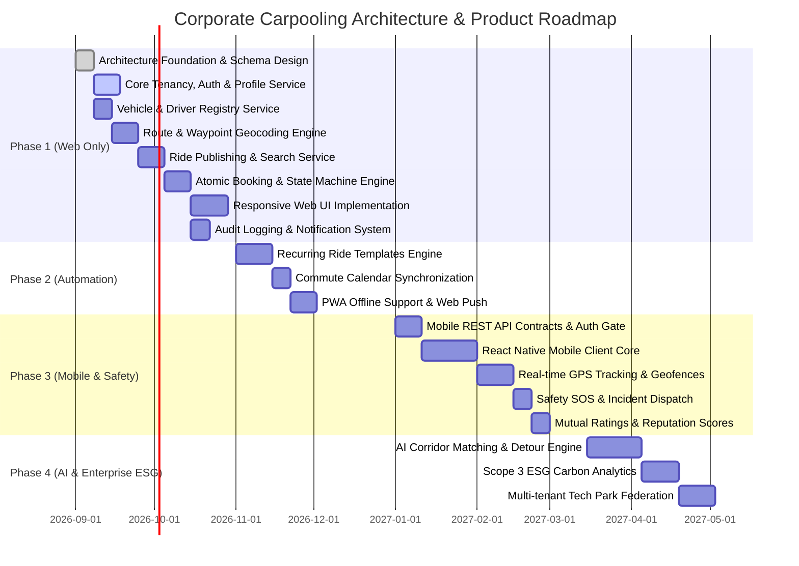

# Product Roadmap: Corporate Carpooling Platform

## 1. Evolution Strategy & Phases

```
+---------------------------------------------------------------------------------------------------+
| PHASE 1: WEB FOUNDATION (CURRENT TARGET)                                                          |
| Q1 - Q2: Core domain, org tenancy, vehicle registry, one-way rides, route corridor discovery,     |
| booking state machines, responsive web UI, audit & notifications.                                 |
+---------------------------------------------------------------------------------------------------+
                                                  |
                                                  v
+---------------------------------------------------------------------------------------------------+
| PHASE 2: COMMUTE AUTOMATION & PWA ENHANCEMENTS                                                    |
| Q3: Recurring ride schedules (templates & instance generation), saved commute presets,           |
| calendar sync (iCal/Outlook), multi-rider manifest optimization, PWA push alerts.                 |
+---------------------------------------------------------------------------------------------------+
                                                  |
                                                  v
+---------------------------------------------------------------------------------------------------+
| PHASE 3: NATIVE MOBILE & REAL-TIME TELEMETRY                                                      |
| Q4: Dedicated iOS & Android apps (React Native/Flutter), driver GPS background tracking,          |
| proximity-based pickup alerts, in-app safety SOS triggers, mutual star ratings & driver feedback. |
+---------------------------------------------------------------------------------------------------+
                                                  |
                                                  v
+---------------------------------------------------------------------------------------------------+
| PHASE 4: ENTERPRISE ESG & AI MATCHING ENGINE                                                      |
| Q1+: AI-powered detour & corridor scoring, cross-organization tech-park clustering,               |
| automated payroll cost-sharing, Scope 3 corporate carbon offset audit reports.                     |
+---------------------------------------------------------------------------------------------------+
```

---

## 2. Roadmap Milestone Details

### Phase 1: Web Foundation (Current Focus)
- **Tenancy & Auth**: Verified enterprise domain signup (`@company.com`), JWT authentication, Org-scoped user models.
- **Identity & Capabilities**: Dual roles (Rider and Driver) per employee; driver vehicle registration and seat capacity limits.
- **Locations & Waypoints**: Saved Home and Office location presets; structured route waypoints (origin, destination, intermediate corridor coordinates).
- **Ride Lifecycle**: Driver ride creation (departure time, available seats, notes); search by origin/destination proximity and departure window.
- **Booking Engine**: Explicit atomic seat reservations with `PENDING` -> `ACCEPTED` / `REJECTED` state transitions. Concurrency-safe against race conditions.
- **Communications**: Real-time in-app notification center + email delivery for lifecycle changes.
- **Compliance & Audit**: Full audit logging for security, cancellations, and capacity alterations.

### Phase 2: Recurring Rides & PWA (Future)
- **Schedule Templates**: Mon-Fri recurring morning/evening commute definitions.
- **Automated Generation**: Background worker generating ride instances `N` days ahead.
- **Calendar Integration**: One-click add to Google Calendar and Microsoft Outlook 365.
- **PWA Capabilities**: Service worker offline shell and Web Push API.

### Phase 3: Mobile Apps & Live Telemetry (Future)
- **Mobile Native**: iOS & Android apps utilizing same RESTful API backend.
- **Driver GPS Streams**: WebSockets/SSE broadcast of driver coordinates during active rides.
- **Pickup Beacons**: Geofence triggers ("Driver is 3 minutes away").
- **Safety & Incident Management**: SOS emergency button with live location broadcast to corporate security.
- **Ratings & Reviews**: Post-ride double-blind 1-5 star ratings and feedback tags.

### Phase 4: Enterprise Intelligence & ESG (Future)
- **AI Corridor Matching**: Vector similarity / geospatial ML matching passenger detour tolerance to driver routes.
- **Carbon Accounting**: Greenhouse Gas (GHG) Protocol Scope 3 commuter emissions reductions dashboard.
- **Corporate Expense Settlement**: Automatic micropayments or corporate commute subsidy credits.
- **Multi-tenant Tech Parks**: Inter-company carpool corridors for shared corporate parks.

---

## 3. Canonical Diagram: Roadmap Progression


