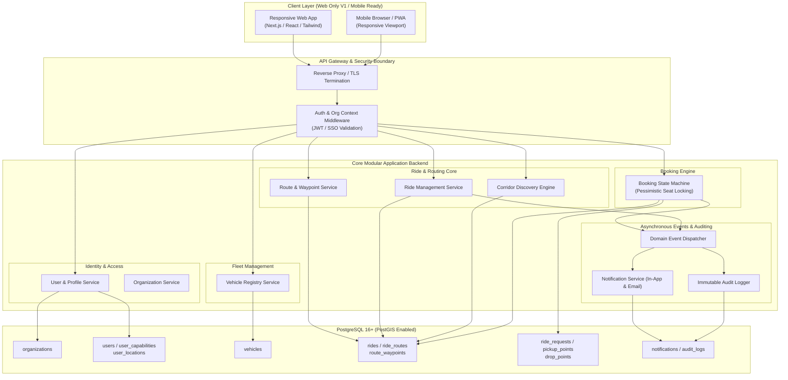

# System Overview: Corporate Carpooling Platform

## 1. High-Level Architecture & Topology

The Corporate Carpooling platform is designed using a layered, domain-centric architecture. For Phase 1 (Web Only), the architecture provides a robust, responsive web interface backed by a modular monolithic REST API with clean domain boundaries and strict multi-tenant isolation.

```
                                  +---------------------------------------+
                                  |     CLIENT LAYER (Phase 1: Web)       |
                                  |   Next.js / React (Responsive Web)    |
                                  |   Desktop Browsers & Mobile Browsers  |
                                  +---------------------------------------+
                                                     |
                                                     | HTTPS / REST / JSON
                                                     v
+---------------------------------------------------------------------------------------------------------+
|                                        API GATEWAY / ROUTING LAYER                                      |
|   - Reverse Proxy & SSL Termination (Nginx / Cloudflare)                                                |
|   - Rate Limiting, CORS, Request Validation & Correlation ID                                            |
|   - Tenant Extraction & Context Injection (Org Header / JWT Claim)                                     |
+---------------------------------------------------------------------------------------------------------+
                                                     |
                                                     v
+---------------------------------------------------------------------------------------------------------+
|                                        CORE APPLICATION SERVICES                                        |
|                                                                                                         |
|  +---------------------+  +---------------------+  +---------------------+  +------------------------+  |
|  |   Identity & Org    |  |  Vehicle Registry   |  |   Route & Geo FSM   |  |     Ride Management    |  |
|  |   - Auth & Session  |  |  - Vehicle Profiles |  |   - Structured Wpts |  |     - Scheduling       |  |
|  |   - Capabilities    |  |  - Capacity Checks  |  |   - Spatial BBox    |  |     - Seat Availability|  |
|  +---------------------+  +---------------------+  +---------------------+  +------------------------+  |
|                                                                                                         |
|  +---------------------+  +---------------------+  +---------------------+  +------------------------+  |
|  | Booking & Seat FSM  |  | Notification Engine |  | Audit & Compliance  |  | Analytics (Future)     |  |
|  | - Atomic Reserve    |  | - In-App Feed       |  | - Immutable Trails  |  | - ESG Carbon Offset    |  |
|  | - Concurrency Guard |  | - Email Outbox      |  | - State Transitions |  | - Corridor Heatmaps    |  |
|  +---------------------+  +---------------------+  +---------------------+  +------------------------+  |
+---------------------------------------------------------------------------------------------------------+
                                                     |
                                                     v
+---------------------------------------------------------------------------------------------------------+
|                                        PERSISTENCE & DATA LAYER                                         |
|  PostgreSQL 16+ with PostGIS Extension:                                                                 |
|  - Relational Integrity, Foreign Keys, Strict Check Constraints                                         |
|  - Spatial Indexing (GIST on geometry/geography)                                                        |
|  - Explicit State Machine Validation Enums                                                             |
|  - Row-Level Tenancy (`organization_id` on all operational tables)                                      |
+---------------------------------------------------------------------------------------------------------+
```

---

## 2. Core Subsystems & Responsibilities

### 2.1 Identity & Organization Access Management
- Validates corporate domain emails (`@org.com`) or corporate identity providers (SAML/OIDC).
- Issues signed, stateless JWT access tokens carrying `user_id`, `organization_id`, and `capabilities`.
- Enforces strict tenant boundaries: all database queries must inject `WHERE organization_id = :org_id`.

### 2.2 Vehicle & Fleet Registry
- Manages employee vehicles: make, model, year, color, license plate, seat count.
- Enforces physical safety caps: a driver cannot offer more seats than the vehicle's legal passenger capacity (`total_seats - 1`).

### 2.3 Route & Geolocation Engine
- Handles structured route definitions (Origin -> Waypoints -> Destination).
- Stores exact coordinates (`DECIMAL(10, 7)`) and optional PostGIS geography points.
- Computes spatial bounding boxes and corridor proximity queries for search operations.
- Separates route definitions from transient ride instances, enabling route reusability.

### 2.4 Ride & Capacity Management
- Manages driver ride offerings with explicit statuses: `DRAFT`, `SCHEDULED`, `IN_PROGRESS`, `COMPLETED`, `CANCELLED`.
- Maintains atomic available seat counts with database-level constraints (`available_seats >= 0`).

### 2.5 Booking & Seat Reservation FSM
- Orchestrates rider seat requests with explicit statuses: `PENDING`, `ACCEPTED`, `REJECTED`, `CANCELLED`, `EXPIRED`.
- Employs **Optimistic Concurrency Control (OCC)** or **Pessimistic Row-Level Locks (`FOR UPDATE`)** during driver acceptance to prevent overbooking races.

### 2.6 Notification & Event Dispatcher
- Provides an asynchronous event bus pattern for domain events (e.g. `RideCreated`, `RequestAccepted`, `RideCancelled`).
- Writes to an in-app notification table and queues outgoing transactional email alerts.
- Extensible to mobile push notifications (APNs / FCM) in Phase 3 without altering core domain logic.

### 2.7 Audit & Security Trail
- An append-only audit ledger recording every lifecycle transition, cancellation, and sensitive data mutation.
- Captures `actor_user_id`, `action`, `from_state`, `to_state`, `ip_address`, and `user_agent`.

---

## 3. Security & Multi-Tenant Isolation Model

1. **Tenant Scoping**:
   - Every operational entity (`users`, `vehicles`, `rides`, `ride_routes`, `ride_requests`, `notifications`, `audit_logs`) has a mandatory `organization_id` foreign key.
   - Cross-organization queries are blocked at the repository/middleware layer.
2. **Authorization Guards**:
   - Capability-based access control (`can_drive`, `can_ride`, `is_org_admin`).
   - Drivers can only accept/reject requests for their own rides.
   - Riders can only view/cancel their own requests.
3. **Data Protection & PII**:
   - License plate and contact numbers visible only to accepted co-passengers on the same ride.
   - Passwords hashed using bcrypt/Argon2id (if not using corporate SSO).

---

## 4. Canonical Diagram: System Architecture & Subsystem Boundaries


